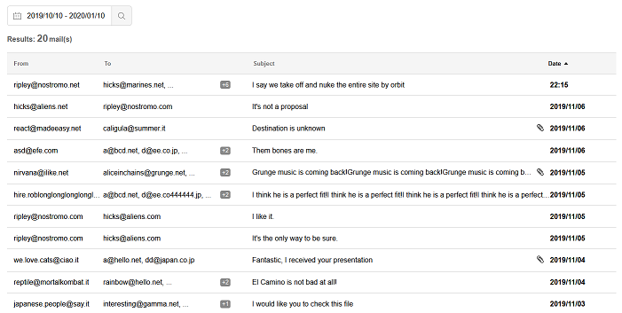
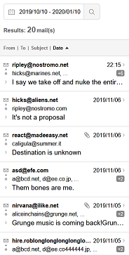

# See it live
https://devendrasaroj.github.io/hennge/

# Final desktop version created

# Final mobile version created

## Report
The main challenge was creating the Badger component, I wanted it to be responsive, smooth and reusable in the future. Figuring out a way to code it was not easy and took some effort to achieve. The component still can be improved but I'm satisfied with the current result.

I also created a MailOpener component which basically allowed users to open each mail indipendently and showed them in a resizable / draggable div, windows style. Finally I decided to remove it since I realized it was not working with the flow of the layout.

The CSS layout took some time to adjust, but finally came up pretty faithful to the example provided.

In conclusion I would say that with this challenge I had the opportunity to learn new things and had fun completing it.

